# Deep Hedging System Flowchart

## Entry Point: trainer.ipynb

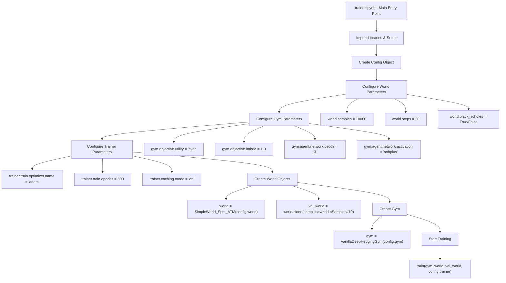

## World Creation (SimpleWorld_Spot_ATM)

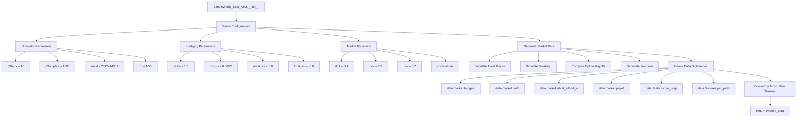

## Gym Creation (VanillaDeepHedgingGym)

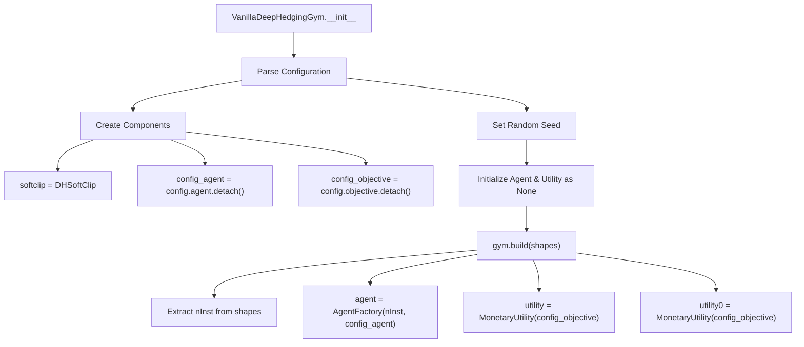

## Agent Creation (AgentFactory)

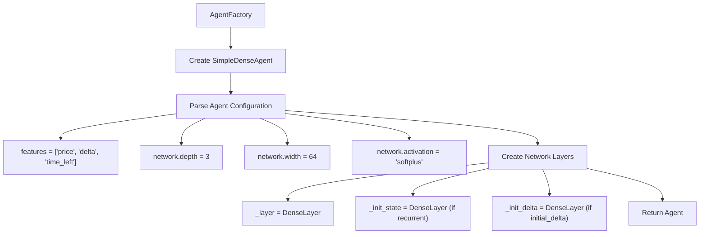

## Training Process (train function)

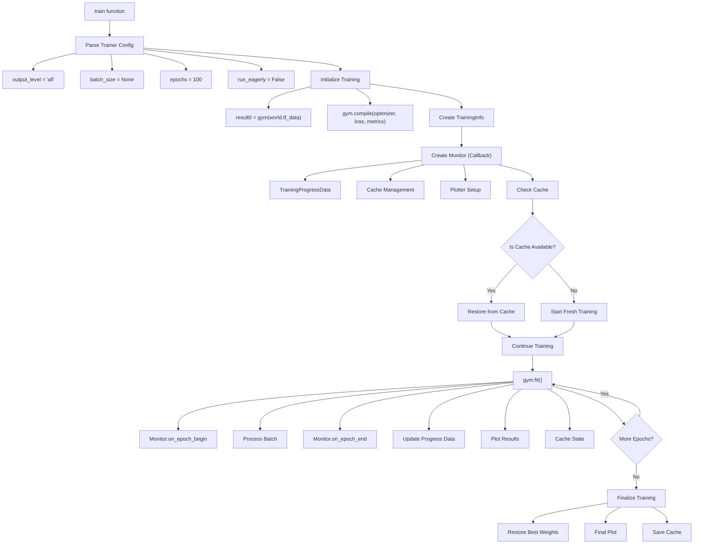

## Main Training Loop (gym._call)

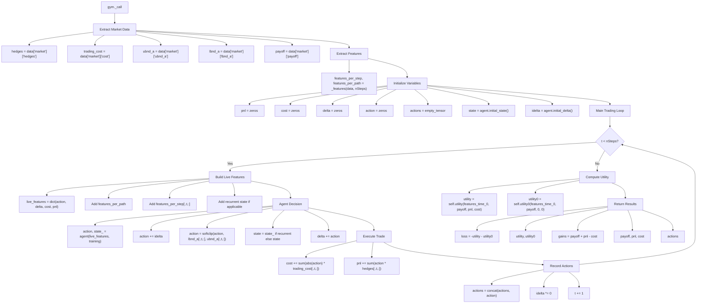

## Agent Decision Process (SimpleDenseAgent.call)

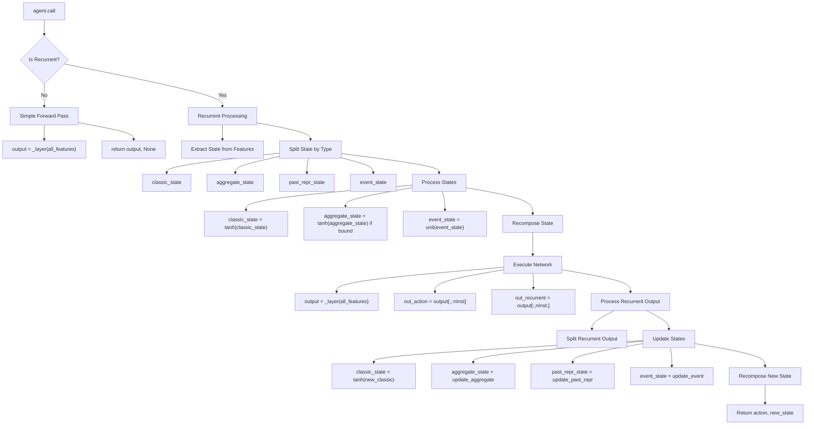

## Utility Computation (MonetaryUtility.call)

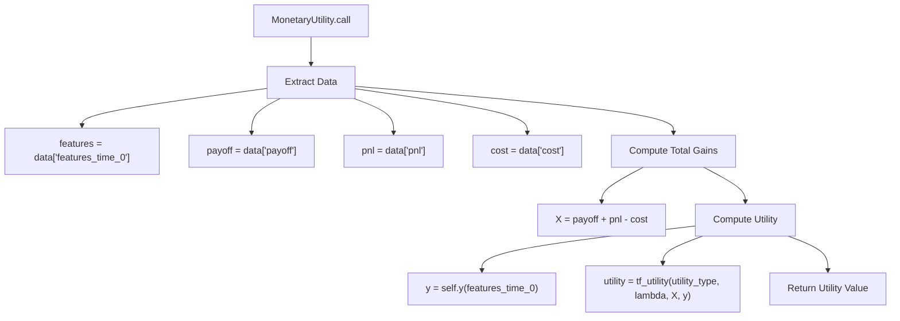

## Feature Processing (_features)

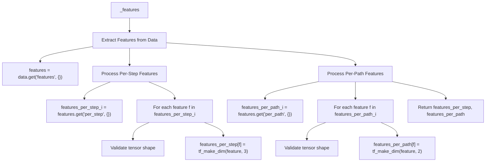

## Monitoring & Visualization

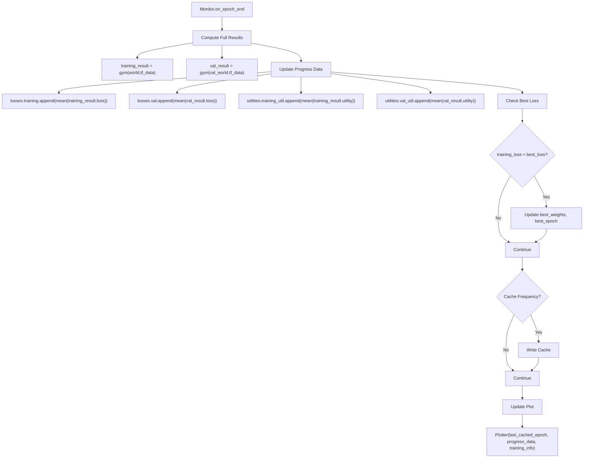

## Key Data Flow Summary

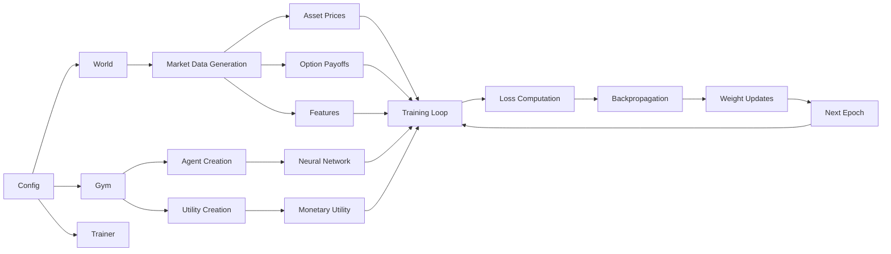

## Configuration Structure

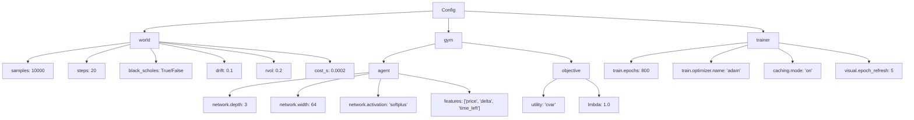